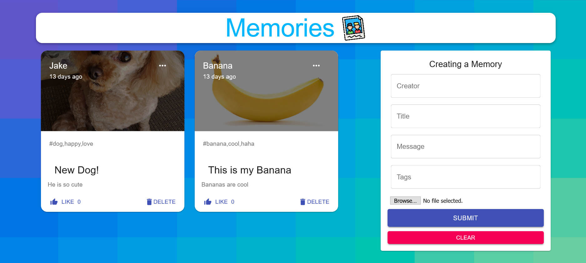

<!-- PROJECT LOGO -->
<br />
<p align="center">
  <a href="https://github.com/jeiku/react-native-shopping-list">
    
  </a>

  <h3 align="center">React Memories</h3>

  <p align="center">
    Fullstack MERN Social Media app allows users to post, update & delete their pictures and captions!
    <br />
    <br />
    <a href="#"><strong>View Demo »</strong></a>
  </p>
</p>

<!-- TABLE OF CONTENTS -->
<details open="open">
  <summary>Table of Contents</summary>
  <ol>
    <li>
      <a href="#about-the-project">About The Project</a>
      <ul>
        <li><a href="#built-with">Built With</a></li>
      </ul>
    </li>
    <li>
      <a href="#getting-started">Getting Started</a>
      <ul>
        <li><a href="#installation">Installation</a></li>
      </ul>
    </li>
    <li><a href="#license">License</a></li>
  </ol>
</details>

<!-- ABOUT THE PROJECT -->

## About The Project


<br />

This is just a simple Fullstack MERN app built in React for practice. Feel free to check it out!

### Built With

- [React](https://reactjs.org/)
- [MongoDB Atlas](https://www.mongodb.com/cloud/atlas)
- [Express](https://expressjs.com/)
- [Node](https://nodejs.org/en/)

<!-- GETTING STARTED -->

## Getting Started

To get a local copy up and running follow these simple steps.

### Installation

1. Clone the repo
   ```sh
   git clone https://github.com/jeiku/react-memories.git
   ```
2. Install NPM packages
   ```sh
   npm install
   ```
3. Add proper variables in '.env'

```JS
CONNECTION_URL = 'enter url'
```

4. Start server
   ```sh
   cd server
   npm start
   ```
5. Start client
   ```sh
   cd client
   npm start
   ```

<!-- LICENSE -->

## License

Distributed under the MIT License. See `LICENSE` for more information.
